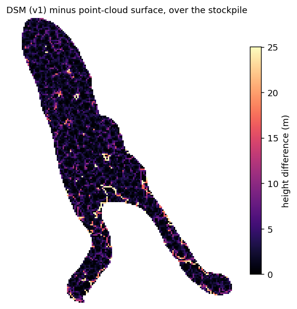

# lidar-forest-pipeline

A reproducible, AI-free pipeline that turns raw airborne-LiDAR flight lines into
forestry deliverables: a classified point cloud, DTM / DSM / CHM / density
rasters, per-polygon canopy statistics, and stockpile volumes.

**A new project is one new config and zero code edits.** The code contains no
paths and no parameters — every value that affects an output lives in a
per-project YAML under [`configs/`](configs/). Every stage is idempotent, guarded
by QC gates, and writes an audit manifest.

Reference dataset: an airborne LiDAR block over managed forest in south-central
Chile (7 strips, 187 M points, ~192 pts/m²). The bundled `configs/template.yaml`
reproduces that block's numbers when pointed at the data; the real project config
is not distributed.

## What it does

```
raw LAZ  (7 strips, 187 M pts)
   │
   ├─ s01  inventory ................. per-tile header/CRS/density  → inventory.csv/json
   ├─ s02  crop to AOI + merge ....... 187 M → 67 M pts             → merged_aoi.laz
   ├─ s03  outlier → SMRF ground ..... noise=7, ground=2            → merged_class.laz   [QC: noise%, ground%]
   ├─ s04  DTM / DSM / density / CHM . fixed 1 m grid               → *.tif              [QC: empty cells]
   ├─ s05  per-zone canopy stats ..... mean / p95 / %cover>2 m      → zone_stats.csv/gpkg
   └─ s06  stockpile volumes ......... dual (a) cloud / (b) DSM     → volumes_summary.json
```

All rasters share one fixed grid (resolution, bounds, CRS) so DTM/DSM/CHM/density
are pixel-aligned across stages and across re-runs.

## Quick start

```bash
# 1. environment (PDAL 2.10, GDAL 3.12, Python 3.11 + geo stack)
conda env create -f environment.yml
conda activate lidar-forest
```

**New project in 5 steps:**

1. **Copy the template.** `cp configs/template.yaml configs/myproject.yaml`.
   Every field is commented (what, units, when to change).
2. **Set `project_root`, paths, `epsg`.** Point `project_root` at the folder that
   holds the inputs (and will hold `out/`); set the LAZ dir, AOI, parcel, land-use
   and stockpile layer paths (absolute, or relative to `project_root`); set
   `project.epsg` to the LAZ CRS.
3. **Set the grid.** Put the AOI extent (rounded to `resolution`) in `grid.bounds`
   and pick `resolution` (1 m forest, 0.25 m stockpiles).
4. **Pick a profile.** Copy the `forestal` / `agro` / `acopios` preset from the
   bottom of `template.yaml` over `classify` + `qc` (+ `grid.resolution`). Only
   `forestal` is validated; the others are starting points.
5. **Dry-run, then run.**

```bash
python run_pipeline.py --config configs/myproject.yaml --all --dry-run  # plan + params, no run
python run_pipeline.py --config configs/myproject.yaml --all            # execute
```

`--config` is mandatory (no default project). Other entry points:

```bash
python run_pipeline.py --config configs/myproject.yaml --from s03   # resume from classify
python run_pipeline.py --config configs/myproject.yaml --only s04   # rebuild rasters only
python run_pipeline.py --config configs/myproject.yaml --all --force  # ignore idempotency
python run_pipeline.py --list-stages                                # list stage names
python stages/s03_classify.py --config configs/myproject.yaml       # any stage standalone
```

Outputs always go to **`{project_root}/out/`** (fixed, never next to the code),
one subfolder per stage, plus `run_manifest.json` and `state/` (idempotency
markers). **Config validation runs first**: the input LAZ dir, AOI, parcel,
land-use and stockpile layers must exist, `epsg` must be valid, and the AOI bbox
must intersect the LAZ footprint — otherwise the run stops immediately (exit 3),
never eight minutes into SMRF.

## Benchmarks

Clean `--all` run from the raw LAZ, reference dataset, single workstation
(7 parallel crop threads):

| stage | step | wall time |
|-------|------|----------:|
| s01 | inventory (7 headers) | 0.7 s |
| s02 | crop 187 M → 67 M pts + merge | 72.5 s |
| s03 | outlier + **SMRF ground** | **~503–524 s** |
| s04 | DTM/DSM/density/CHM + hillshades | 157.2 s |
| s05 | zone stats (30 polygons) | 0.3 s |
| s06 | dual-path stockpile volumes | 85.1 s |
| | **total** | **~840 s** |

SMRF ground classification on the 67 M-point cloud is ~60 % of the runtime and
dominates everything else; run-to-run variation is a few percent. Everything
downstream of s03 is cheap.

## Design decisions

**Library defaults are not reproducibility — pin every parameter.** This is the
central lesson. `writers.gdal` defaults `radius` to `resolution·√2 = 1.4142 m`,
which silently broke two products until the radius was made explicit:

- **Density inflated ~6×.** With the default radius each 1 m `count` cell gathered
  points from a 1.41 m circle overlapping its neighbours: the density raster
  averaged **1146 pts/cell** vs **288** once the radius was set to the
  circumscribing **0.7071 m** (the true areal density is ~192 pts/m²).
- **DSM biased +3.21 m.** The default radius plus `window_size=3` (moving-window
  gap fill) fabricated coverage and lifted the per-cell maximum. Over the
  stockpile the DSM sat a mean **+3.21 m** above the point-cloud surface. Setting
  `radius=0.7071, window_size=0` removed a mean +2.1 m bias on shared cells and
  cut a 171.7 m artefact spike out of the CHM.

So the config pins the radius of **every** `writers.gdal` product, and pins even
values that equal a default (e.g. DTM `radius=1.4142`, `power=1.0`; SMRF
`window=18`, `cell=1.0`) so a deliverable never depends on a tool's
version-specific defaults.

**Explicit, per-product radii.** Terrain (DTM) legitimately bridges ground gaps,
so it keeps IDW with the wide `radius=1.4142` and `window_size=3`. Surface
products (DSM, density) must represent only real returns, so they use the tight
`radius=0.7071` and `window_size=0` (no fill). Same writer, two deliberate
configurations — not one default for both.

**Crop early.** Each flight line is cropped to the AOI *before* the merge, so the
expensive merge and SMRF run on 67 M points instead of the full 187 M survey.

**Spec vs as-built — the config records what was actually run.** Where a written
spec and the scripts that produced the delivered numbers disagreed (e.g. an
intended ELM pre-filter that was never run; SMRF values that turned out to be the
tool defaults rather than the overrides actually used), the **as-built values are
authoritative** and are what the config pins. Methodology changes are treated as
a *controlled re-baseline*: apply the change, re-run end to end, record the new
reference metrics in a fresh `run_manifest.json` — never a silent parameter edit.

**QC gates (stop the run, exit 2).** Thresholds live only in `config.yaml → qc`:
noise (class 7) `> 3 %` → stop; ground (class 2) outside `10–50 %` → stop; any
empty 1 m cell inside the parcel boundary → stop and export `huecos.shp`.

**Read the stage-03 hillshade on new terrain.** The gates catch gross failures;
the hillshade catches the subtle ones the percentages miss. Before accepting a
classification on a new site, open `out/04_rasters/dtm_hillshade.tif` next to
`dsm_hillshade.tif`: the DTM hillshade must look like bare ground — smooth, no
building/tree bumps punched into it, no ground "melting" on slopes. If it doesn't,
the SMRF `slope`/`threshold`/`scalar` are wrong for the site; retune (see the
agro/acopios presets) and re-run stage 03 before trusting any downstream number.

**Audit trail.** Every run (re)writes `out/run_manifest.json`: date, tool versions
(pdal/gdal/python), config SHA-256, per-stage wall time, and the key metrics.
Archive it with the outputs — it is the reproducibility record of the deliverable.

## Validation

The stockpile volume is computed two independent ways against the same reference
DTM: **(a)** from the point cloud (highest return per cell) and **(b)** from the
DSM raster. Agreement between two methods that share no intermediate is the
cross-check that the volume is real and not an artefact of either surface.

With the **uncorrected** DSM (default radius + `window_size=3`) the raster path
overshot the cloud by **+10.9 %** — the DSM's fabricated coverage and inflated
maxima, mapped below over the stockpile (mean **+3.21 m**, up to 34 m along
edges):



After pinning `radius=0.7071, window_size=0`, the DSM path fell 8.0 % and the two
methods **converged to +2.02 %** — within expected method noise:

| variant | net volume | vs (a) |
|---------|-----------:|-------:|
| (a) point cloud | 218 467 m³ | — |
| (b) DSM (uncorrected) | 242 284 m³ | +10.9 % |
| (b) DSM (corrected) | 222 889 m³ | **+2.02 %** |

A full case study is in [`docs/validation_case_study.md`](docs/validation_case_study.md).

## Future work / candidate improvements

To be evaluated **against this baseline** with a controlled, documented
re-baseline (new reference metrics recorded in a fresh `run_manifest.json`):

- **ELM pre-filter.** Add `filters.elm` ahead of SMRF to catch low outliers the
  statistical filter misses. Not in the current baseline; would shift ground %
  and must be re-validated end to end.
- **SMRF parameter sweep.** Grid-search `slope / threshold / scalar / window`
  around the forest values and compare ground fraction and DTM residuals, rather
  than accepting the first working set.
- **Validate the `agro` and `acopios` profiles.** Both ship as starting points
  only; each needs the hillshade check and a metrics re-baseline on real data of
  its type before its numbers can be trusted.

## License

MIT — see [LICENSE](LICENSE).
