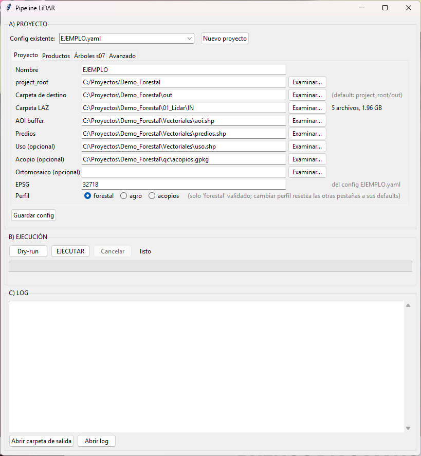

# lidar-forest-pipeline

A reproducible, AI-free pipeline that turns raw airborne-LiDAR flight lines into
forestry deliverables: a classified point cloud, DTM / DSM / CHM / density
rasters, per-polygon canopy statistics, and stockpile volumes.

*Un pipeline reproducible y sin IA que convierte líneas de vuelo LiDAR
aerotransportado crudas en entregables forestales: nube de puntos clasificada,
rásters DTM / DSM / CHM / densidad, estadísticas de dosel por polígono y
volúmenes de acopio.*

**A new project is one new config and zero code edits** — every value that
affects an output lives in a per-project YAML, and each stage is idempotent,
guarded by QC gates, and writes an audit manifest.

*Un proyecto nuevo es un config nuevo y cero cambios de código — cada valor que
afecta una salida vive en un YAML por proyecto, y cada etapa es idempotente,
protegida por QC gates y escribe un manifest de auditoría.*

---

## EN

A reproducible, AI-free pipeline that turns raw airborne-LiDAR flight lines into
forestry deliverables: a classified point cloud, DTM / DSM / CHM / density
rasters, per-polygon canopy statistics, and stockpile volumes.

**A new project is one new config and zero code edits.** The code contains no
paths and no parameters — every value that affects an output lives in a
per-project YAML under [`configs/`](configs/). Every stage is idempotent, guarded
by QC gates, and writes an audit manifest.

Reference dataset: an airborne LiDAR block over managed forest in south-central
Chile (7 strips, 187 M points, ~192 pts/m²). The bundled `configs/template.yaml`
reproduces that block's numbers when pointed at the data; the real project config
is not distributed.

### What it does

```
raw LAZ  (7 strips, 187 M pts)
   │
   ├─ s01  inventory ................. per-tile header/CRS/density  → inventory.csv/json
   ├─ s02  crop to AOI + merge ....... 187 M → 67 M pts             → merged_aoi.laz
   ├─ s03  outlier → SMRF ground ..... noise=7, ground=2            → merged_class.laz   [QC: noise%, ground%]
   ├─ s04  DTM / DSM / density / CHM . fixed 1 m grid               → *.tif              [QC: empty cells]
   ├─ s05  per-zone canopy stats ..... mean / p95 / %cover>2 m      → zone_stats.csv/gpkg
   └─ s06  stockpile volumes ......... dual (a) cloud / (b) DSM     → volumes_summary.json
```

All rasters share one fixed grid (resolution, bounds, CRS) so DTM/DSM/CHM/density
are pixel-aligned across stages and across re-runs.

### Quick start

```bash
# 1. environment (PDAL 2.10, GDAL 3.12, Python 3.11 + geo stack)
conda env create -f environment.yml
conda activate lidar-forest
```

**New project in 5 steps:**

1. **Copy the template.** `cp configs/template.yaml configs/myproject.yaml`.
   Every field is commented (what, units, when to change).
2. **Set `project_root`, paths, `epsg`.** Point `project_root` at the folder that
   holds the inputs (and will hold `out/`); set the LAZ dir, AOI, parcel, land-use
   and stockpile layer paths (absolute, or relative to `project_root`); set
   `project.epsg` to the LAZ CRS.
3. **Set the grid.** Put the AOI extent (rounded to `resolution`) in `grid.bounds`
   and pick `resolution` (1 m forest, 0.25 m stockpiles).
4. **Pick a profile.** Copy the `forestal` / `agro` / `acopios` preset from the
   bottom of `template.yaml` over `classify` + `qc` (+ `grid.resolution`). Only
   `forestal` is validated; the others are starting points.
5. **Dry-run, then run.**

```bash
python run_pipeline.py --config configs/myproject.yaml --all --dry-run  # plan + params, no run
python run_pipeline.py --config configs/myproject.yaml --all            # execute
```

`--config` is mandatory (no default project). Other entry points:

```bash
python run_pipeline.py --config configs/myproject.yaml --from s03   # resume from classify
python run_pipeline.py --config configs/myproject.yaml --only s04   # rebuild rasters only
python run_pipeline.py --config configs/myproject.yaml --all --force  # ignore idempotency
python run_pipeline.py --list-stages                                # list stage names
python stages/s03_classify.py --config configs/myproject.yaml       # any stage standalone
```

Outputs go to **`{project_root}/out/`** by default (`paths.output_dir` overrides
it), one subfolder per stage, plus `run_manifest.json` and `state/` (idempotency
markers). The first run drops a `.project_id` marker in the output folder; a
config with another `project.name` pointing at the same folder is rejected
(exit 3), so two projects can never mix outputs. **Config validation runs first**: the input LAZ dir, AOI, parcel,
land-use and stockpile layers must exist, `epsg` must be valid, and the AOI bbox
must intersect the LAZ footprint — otherwise the run stops immediately (exit 3),
never eight minutes into SMRF.

### GUI



Desktop interface (tkinter, no new dependencies) to create configs and launch
runs without a terminal. On Windows, double-click **`lanzar_pipeline.bat`** (repo
root): it activates the conda env declared in `environment.yml` (falling back to
`base` if missing) and opens the GUI. If something fails, the window stays paused
so you can read the error. Manual launch: `python gui/pipeline_gui.py`.

- **A) Project** — pick an existing config (`configs/*.yaml`, template excluded)
  or "New project": the form validates paths, counts the LAZ, autodetects the AOI
  EPSG, computes `grid.bounds` (shown for confirmation) and writes the YAML via
  `scripts/project_setup.py` — the same logic as the console wizard
  `scripts/new_project.py`.
- **B) Execution** — `Dry-run` / `RUN` / `Cancel`. Runs `run_pipeline.py` as a
  subprocess with live output, a per-stage progress bar and a final status:
  green = OK, amber = QC stop (exit 2), red = error. Cancel terminates the process
  and its children (pdal) after confirmation.
- **C) Log** — live output + "Open output folder" and "Open log" buttons. Every
  real run is mirrored to `{project_root}/out/logs/run_YYYYMMDD_HHMMSS.log`
  (referenced in `run_manifest.json → log_path`).

The GUI holds no pipeline logic or parameters: it only writes/selects configs and
launches the process.

**Desktop shortcut with icon:** right-click `lanzar_pipeline.bat` → *Send to →
Desktop (create shortcut)*. Then right-click the shortcut → *Properties → Change
icon...* and choose a `.ico` (or one from `C:\Windows\System32\shell32.dll`).
Under *Run:* you can pick "Minimized" to hide the launcher console.

### Benchmarks

Clean `--all` run from the raw LAZ, reference dataset, single workstation
(7 parallel crop threads):

| stage | step | wall time |
|-------|------|----------:|
| s01 | inventory (7 headers) | 0.7 s |
| s02 | crop 187 M → 67 M pts + merge | 72.5 s |
| s03 | outlier + **SMRF ground** | **~503–524 s** |
| s04 | DTM/DSM/density/CHM + hillshades | 157.2 s |
| s05 | zone stats (30 polygons) | 0.3 s |
| s06 | dual-path stockpile volumes | 85.1 s |
| | **total** | **~840 s** |

SMRF ground classification on the 67 M-point cloud is ~60 % of the runtime and
dominates everything else; run-to-run variation is a few percent. Everything
downstream of s03 is cheap.

### Design decisions

**Library defaults are not reproducibility — pin every parameter.** This is the
central lesson. `writers.gdal` defaults `radius` to `resolution·√2 = 1.4142 m`,
which silently broke two products until the radius was made explicit:

- **Density inflated ~6×.** With the default radius each 1 m `count` cell gathered
  points from a 1.41 m circle overlapping its neighbours: the density raster
  averaged **1146 pts/cell** vs **288** once the radius was set to the
  circumscribing **0.7071 m** (the true areal density is ~192 pts/m²).
- **DSM biased +3.21 m.** The default radius plus `window_size=3` (moving-window
  gap fill) fabricated coverage and lifted the per-cell maximum. Over the
  stockpile the DSM sat a mean **+3.21 m** above the point-cloud surface. Setting
  `radius=0.7071, window_size=0` removed a mean +2.1 m bias on shared cells and
  cut a 171.7 m artefact spike out of the CHM.

So the config pins the radius of **every** `writers.gdal` product, and pins even
values that equal a default (e.g. DTM `radius=1.4142`, `power=1.0`; SMRF
`window=18`, `cell=1.0`) so a deliverable never depends on a tool's
version-specific defaults.

**Explicit, per-product radii.** Terrain (DTM) legitimately bridges ground gaps,
so it keeps IDW with the wide `radius=1.4142` and `window_size=3`. Surface
products (DSM, density) must represent only real returns, so they use the tight
`radius=0.7071` and `window_size=0` (no fill). Same writer, two deliberate
configurations — not one default for both.

**Crop early.** Each flight line is cropped to the AOI *before* the merge, so the
expensive merge and SMRF run on 67 M points instead of the full 187 M survey.

**Spec vs as-built — the config records what was actually run.** Where a written
spec and the scripts that produced the delivered numbers disagreed (e.g. an
intended ELM pre-filter that was never run; SMRF values that turned out to be the
tool defaults rather than the overrides actually used), the **as-built values are
authoritative** and are what the config pins. Methodology changes are treated as
a *controlled re-baseline*: apply the change, re-run end to end, record the new
reference metrics in a fresh `run_manifest.json` — never a silent parameter edit.

**QC gates (stop the run, exit 2).** Thresholds live only in `config.yaml → qc`:
noise (class 7) `> 3 %` → stop; ground (class 2) outside `10–50 %` → stop; any
empty 1 m cell inside the parcel boundary → stop and export `huecos.shp`.

**Read the stage-03 hillshade on new terrain.** The gates catch gross failures;
the hillshade catches the subtle ones the percentages miss. Before accepting a
classification on a new site, open `out/04_rasters/dtm_hillshade.tif` next to
`dsm_hillshade.tif`: the DTM hillshade must look like bare ground — smooth, no
building/tree bumps punched into it, no ground "melting" on slopes. If it doesn't,
the SMRF `slope`/`threshold`/`scalar` are wrong for the site; retune (see the
agro/acopios presets) and re-run stage 03 before trusting any downstream number.

**Audit trail.** Every run (re)writes `out/run_manifest.json`: date, tool versions
(pdal/gdal/python), config SHA-256, per-stage wall time, and the key metrics.
Archive it with the outputs — it is the reproducibility record of the deliverable.

### Validation

The stockpile volume is computed two independent ways against the same reference
DTM: **(a)** from the point cloud (highest return per cell) and **(b)** from the
DSM raster. Agreement between two methods that share no intermediate is the
cross-check that the volume is real and not an artefact of either surface.

With the **uncorrected** DSM (default radius + `window_size=3`) the raster path
overshot the cloud by **+10.9 %** — the DSM's fabricated coverage and inflated
maxima, mapped below over the stockpile (mean **+3.21 m**, up to 34 m along
edges):


After pinning `radius=0.7071, window_size=0`, the DSM path fell 8.0 % and the two
methods **converged to +2.3 %** — within expected method noise:

| variant | net volume | vs (a) |
|---------|-----------:|-------:|
| (a) point cloud | 217 876 m³ | — |
| (b) DSM (uncorrected) | 242 284 m³ | +11.2 % |
| (b) DSM (corrected) | 222 889 m³ | **+2.3 %** |

These are the **v2 reference values**. The v1 figure (218 467 m³, delta +2.02 %)
silently depended on the input's extent: the cloud-gridding origin was taken from
the westmost/northmost point fed in. The grid is now anchored to multiples of the
resolution, so the volume is invariant to cropping — see the second lesson in the
case study.

A full case study is in [`docs/validation_case_study.md`](docs/validation_case_study.md).

### Future work / candidate improvements

To be evaluated **against this baseline** with a controlled, documented
re-baseline (new reference metrics recorded in a fresh `run_manifest.json`):

- **ELM pre-filter.** Add `filters.elm` ahead of SMRF to catch low outliers the
  statistical filter misses. Not in the current baseline; would shift ground %
  and must be re-validated end to end.
- **SMRF parameter sweep.** Grid-search `slope / threshold / scalar / window`
  around the forest values and compare ground fraction and DTM residuals, rather
  than accepting the first working set.
- **Validate the `agro` and `acopios` profiles.** Both ship as starting points
  only; each needs the hillshade check and a metrics re-baseline on real data of
  its type before its numbers can be trusted.

### License

MIT — see [LICENSE](LICENSE).

---

## ES

Un pipeline reproducible y sin IA que convierte líneas de vuelo LiDAR
aerotransportado crudas en entregables forestales: nube de puntos clasificada,
rásters DTM / DSM / CHM / densidad, estadísticas de dosel por polígono y
volúmenes de acopio.

**Un proyecto nuevo es un config nuevo y cero cambios de código.** El código no
contiene rutas ni parámetros — cada valor que afecta una salida vive en un YAML
por proyecto bajo [`configs/`](configs/). Cada etapa es idempotente, protegida
por QC gates y escribe un manifest de auditoría.

Dataset de referencia: un bloque LiDAR aerotransportado sobre bosque manejado en
el centro-sur de Chile (7 fajas, 187 M de puntos, ~192 pts/m²). El
`configs/template.yaml` incluido reproduce las cifras de ese bloque cuando se
apunta a los datos; el config del proyecto real no se distribuye.

### Qué hace

```
LAZ crudo  (7 fajas, 187 M pts)
   │
   ├─ s01  inventario ............... header/CRS/densidad por tile    → inventory.csv/json
   ├─ s02  recorte a AOI + fusión ... 187 M → 67 M pts                → merged_aoi.laz
   ├─ s03  outlier → suelo SMRF ..... ruido=7, suelo=2                → merged_class.laz   [QC: %ruido, %suelo]
   ├─ s04  DTM / DSM / densidad / CHM  grilla fija de 1 m             → *.tif              [QC: celdas vacías]
   ├─ s05  stats de dosel por zona .. media / p95 / %cobertura>2 m    → zone_stats.csv/gpkg
   └─ s06  volúmenes de acopio ...... dual (a) nube / (b) DSM         → volumes_summary.json
```

Todos los rásters comparten una grilla fija (resolución, límites, CRS), de modo
que DTM/DSM/CHM/densidad quedan alineados a nivel de píxel entre etapas y entre
corridas.

### Inicio rápido

```bash
# 1. entorno (PDAL 2.10, GDAL 3.12, Python 3.11 + stack geoespacial)
conda env create -f environment.yml
conda activate lidar-forest
```

**Proyecto nuevo en 5 pasos:**

1. **Copia el template.** `cp configs/template.yaml configs/miproyecto.yaml`.
   Cada campo está comentado (qué es, unidades, cuándo cambiarlo).
2. **Define `project_root`, rutas, `epsg`.** Apunta `project_root` a la carpeta
   que contiene los insumos (y que contendrá `out/`); define las rutas de la
   carpeta LAZ, AOI, predio, uso de suelo y capa de acopio (absolutas, o relativas
   a `project_root`); pon `project.epsg` en el CRS de los LAZ.
3. **Define la grilla.** Pon la extensión del AOI (redondeada a `resolution`) en
   `grid.bounds` y elige `resolution` (1 m bosque, 0.25 m acopios).
4. **Elige un perfil.** Copia el preset `forestal` / `agro` / `acopios` del final
   de `template.yaml` sobre `classify` + `qc` (+ `grid.resolution`). Solo
   `forestal` está validado; los demás son puntos de partida.
5. **Dry-run, luego corrida.**

```bash
python run_pipeline.py --config configs/miproyecto.yaml --all --dry-run  # plan + params, sin correr
python run_pipeline.py --config configs/miproyecto.yaml --all            # ejecuta
```

`--config` es obligatorio (sin proyecto por defecto). Otros puntos de entrada:

```bash
python run_pipeline.py --config configs/miproyecto.yaml --from s03   # retomar desde clasificar
python run_pipeline.py --config configs/miproyecto.yaml --only s04   # rehacer solo los rásters
python run_pipeline.py --config configs/miproyecto.yaml --all --force  # ignorar idempotencia
python run_pipeline.py --list-stages                                # listar nombres de etapa
python stages/s03_classify.py --config configs/miproyecto.yaml       # cualquier etapa suelta
```

Las salidas van a **`{project_root}/out/`** por defecto (`paths.output_dir` lo
sobrescribe), una subcarpeta por etapa, más `run_manifest.json` y `state/`
(marcadores de idempotencia). La primera corrida deja un marcador `.project_id` en
la carpeta de salida; un config con otro `project.name` apuntando a la misma
carpeta es rechazado (exit 3), así dos proyectos nunca pueden mezclar salidas. **La
validación del config corre primero**: la carpeta LAZ de entrada, el AOI, el
predio, las capas de uso de suelo y acopio deben existir, `epsg` debe ser válido,
y el bbox del AOI debe intersectar la huella de los LAZ — de lo contrario la
corrida se detiene de inmediato (exit 3), nunca a los ocho minutos dentro de SMRF.

### GUI


Interfaz de escritorio (tkinter, sin dependencias nuevas) para crear configs y
lanzar corridas sin terminal. En Windows, doble clic en **`lanzar_pipeline.bat`**
(raíz del repo): activa el env conda declarado en `environment.yml` (si no
existe intenta `base`) y abre la GUI. Si algo falla, la ventana queda pausada
para leer el error. Arranque manual: `python gui/pipeline_gui.py`.

- **A) Proyecto** — elegir un config existente (`configs/*.yaml`, sin el
  template) o "Nuevo proyecto": el formulario valida rutas, cuenta los LAZ,
  autodetecta el EPSG del AOI, calcula `grid.bounds` (se muestran para
  confirmar) y escribe el YAML vía `scripts/project_setup.py` — la misma
  lógica que el wizard de consola `scripts/new_project.py`.
- **B) Ejecución** — `Dry-run` / `EJECUTAR` / `Cancelar`. Corre
  `run_pipeline.py` como subproceso con salida en vivo, barra de progreso por
  etapa y estado final: verde = OK, ámbar = QC stop (exit 2), rojo = error.
  Cancelar termina el proceso y sus hijos (pdal) previa confirmación.
- **C) Log** — salida en vivo + botones "Abrir carpeta de salida" y "Abrir
  log". Cada corrida real queda espejada en
  `{project_root}/out/logs/run_YYYYMMDD_HHMMSS.log` (referenciado en
  `run_manifest.json → log_path`).

La GUI no contiene lógica de pipeline ni parámetros: solo escribe/selecciona
configs y lanza el proceso.

**Acceso directo con ícono:** clic derecho en `lanzar_pipeline.bat` → *Enviar
a → Escritorio (crear acceso directo)*. Luego, clic derecho en el acceso
directo → *Propiedades → Cambiar icono...* y elegir un `.ico` (o uno de
`C:\Windows\System32\shell32.dll`). En *Ejecutar:* puede elegirse "Minimizada"
para ocultar la consola del lanzador.

### Benchmarks

Corrida limpia `--all` desde los LAZ crudos, dataset de referencia, una sola
estación de trabajo (7 hilos de recorte en paralelo):

| etapa | paso | tiempo |
|-------|------|-------:|
| s01 | inventario (7 headers) | 0.7 s |
| s02 | recorte 187 M → 67 M pts + fusión | 72.5 s |
| s03 | outlier + **suelo SMRF** | **~503–524 s** |
| s04 | DTM/DSM/densidad/CHM + hillshades | 157.2 s |
| s05 | stats de zona (30 polígonos) | 0.3 s |
| s06 | volúmenes de acopio doble vía | 85.1 s |
| | **total** | **~840 s** |

La clasificación de suelo SMRF sobre la nube de 67 M de puntos es ~60 % del
tiempo de corrida y domina todo lo demás; la variación entre corridas es de unos
pocos por ciento. Todo lo posterior a s03 es barato.

### Decisiones de diseño

**Los defaults de librería no son reproducibilidad — fija cada parámetro.** Esta
es la lección central. `writers.gdal` deja `radius` por defecto en
`resolución·√2 = 1.4142 m`, lo que rompió silenciosamente dos productos hasta que
el radio se hizo explícito:

- **Densidad inflada ~6×.** Con el radio por defecto, cada celda `count` de 1 m
  reunía puntos de un círculo de 1.41 m que se solapaba con sus vecinas: el ráster
  de densidad promediaba **1146 pts/celda** vs **288** una vez fijado el radio al
  **0.7071 m** circunscrito (la densidad areal real es ~192 pts/m²).
- **DSM sesgado +3.21 m.** El radio por defecto más `window_size=3` (relleno de
  huecos por ventana móvil) fabricaba cobertura y elevaba el máximo por celda.
  Sobre el acopio el DSM quedaba en promedio **+3.21 m** por encima de la
  superficie de la nube. Fijar `radius=0.7071, window_size=0` eliminó un sesgo
  medio de +2.1 m en celdas compartidas y quitó un pico-artefacto de 171.7 m del
  CHM.

Por eso el config fija el radio de **cada** producto de `writers.gdal`, y fija
incluso valores que coinciden con un default (p. ej. DTM `radius=1.4142`,
`power=1.0`; SMRF `window=18`, `cell=1.0`), para que un entregable nunca dependa
de los defaults específicos de la versión de una herramienta.

**Radios explícitos, por producto.** El terreno (DTM) legítimamente salva huecos
de suelo, así que conserva IDW con el radio amplio `radius=1.4142` y
`window_size=3`. Los productos de superficie (DSM, densidad) deben representar
solo retornos reales, así que usan el radio estricto `radius=0.7071` y
`window_size=0` (sin relleno). Mismo writer, dos configuraciones deliberadas — no
un default para ambos.

**Recorta temprano.** Cada línea de vuelo se recorta al AOI *antes* de la fusión,
de modo que la fusión costosa y el SMRF corren sobre 67 M de puntos en vez del
levantamiento completo de 187 M.

**Spec vs as-built — el config registra lo que realmente se corrió.** Donde una
especificación escrita y los scripts que produjeron las cifras entregadas
diferían (p. ej. un pre-filtro ELM que se pensó pero nunca corrió; valores de
SMRF que resultaron ser los defaults de la herramienta y no los overrides
realmente usados), los **valores as-built son autoritativos** y son lo que el
config fija. Los cambios de metodología se tratan como un *re-baseline
controlado*: aplica el cambio, re-corre de punta a punta, registra las nuevas
métricas de referencia en un `run_manifest.json` fresco — nunca una edición
silenciosa de parámetros.

**QC gates (detienen la corrida, exit 2).** Los umbrales viven solo en
`config.yaml → qc`: ruido (clase 7) `> 3 %` → detener; suelo (clase 2) fuera de
`10–50 %` → detener; cualquier celda de 1 m vacía dentro del límite del predio →
detener y exportar `huecos.shp`.

**Lee el hillshade de la etapa 03 en terreno nuevo.** Los gates atrapan fallas
groseras; el hillshade atrapa las sutiles que los porcentajes no ven. Antes de
aceptar una clasificación en un sitio nuevo, abre `out/04_rasters/dtm_hillshade.tif`
junto a `dsm_hillshade.tif`: el hillshade del DTM debe verse como suelo desnudo —
suave, sin bultos de edificios/árboles incrustados, sin suelo "derritiéndose" en
pendientes. Si no es así, el `slope`/`threshold`/`scalar` del SMRF están mal para
el sitio; reajusta (ver los presets agro/acopios) y re-corre la etapa 03 antes de
confiar en cualquier cifra aguas abajo.

**Rastro de auditoría.** Cada corrida (re)escribe `out/run_manifest.json`: fecha,
versiones de herramientas (pdal/gdal/python), SHA-256 del config, tiempo por etapa
y las métricas clave. Archívalo con las salidas — es el registro de
reproducibilidad del entregable.

### Validación

El volumen de acopio se calcula de dos formas independientes contra el mismo DTM
de referencia: **(a)** desde la nube de puntos (retorno más alto por celda) y
**(b)** desde el ráster DSM. La concordancia entre dos métodos que no comparten
intermedios es la verificación cruzada de que el volumen es real y no un artefacto
de una u otra superficie.

Con el DSM **sin corregir** (radio por defecto + `window_size=3`) la vía ráster
excedió a la nube en **+10.9 %** — la cobertura fabricada del DSM y sus máximos
inflados, mapeados abajo sobre el acopio (media **+3.21 m**, hasta 34 m en los
bordes):


Tras fijar `radius=0.7071, window_size=0`, la vía DSM bajó 8.0 % y los dos métodos
**convergieron a +2.3 %** — dentro del ruido esperable del método:

| variante | volumen neto | vs (a) |
|----------|-------------:|-------:|
| (a) nube de puntos | 217 876 m³ | — |
| (b) DSM (sin corregir) | 242 284 m³ | +11.2 % |
| (b) DSM (corregido) | 222 889 m³ | **+2.3 %** |

Estos son los **valores de referencia v2**. La cifra v1 (218 467 m³, delta
+2.02 %) dependía silenciosamente de la extensión del input: el origen del
grillado de la nube se tomaba del punto más al oeste/norte alimentado. Ahora la
grilla está anclada a múltiplos de la resolución, así que el volumen es invariante
al recorte — ver la segunda lección en el caso de estudio.

Un caso de estudio completo está en [`docs/validation_case_study.md`](docs/validation_case_study.md).

### Trabajo futuro / mejoras candidatas

A evaluar **contra este baseline** con un re-baseline controlado y documentado
(nuevas métricas de referencia registradas en un `run_manifest.json` fresco):

- **Pre-filtro ELM.** Agregar `filters.elm` antes de SMRF para atrapar outliers
  bajos que el filtro estadístico no ve. No está en el baseline actual;
  desplazaría el % de suelo y debe re-validarse de punta a punta.
- **Barrido de parámetros SMRF.** Búsqueda en grilla de `slope / threshold /
  scalar / window` alrededor de los valores forestales y comparar la fracción de
  suelo y los residuos del DTM, en vez de aceptar el primer set que funciona.
- **Validar los perfiles `agro` y `acopios`.** Ambos vienen solo como puntos de
  partida; cada uno necesita el chequeo del hillshade y un re-baseline de métricas
  sobre datos reales de su tipo antes de poder confiar en sus cifras.

### Licencia

MIT — ver [LICENSE](LICENSE).
